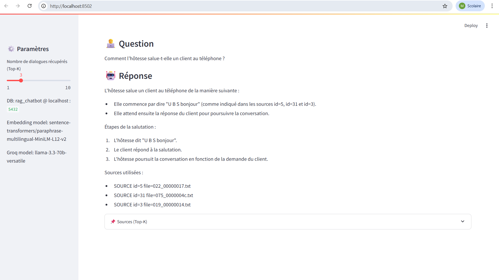

# 💬 RAG Chatbot – Analysis of Telephone Dialogues

This project implements a **Retrieval-Augmented Generation (RAG)** system to analyze and query real telephone dialogues between a **hostess** and **clients**.

The system combines **semantic search using vector embeddings** with **LLM-based response generation**, ensuring **factual, traceable, and context-aware answers**.

---

## 🚀 Project Overview

The chatbot allows users to ask natural language questions about customer service conversations, such as:

- How a call is opened  
- How customer requests are handled  
- What communication best practices are used  
- How calls are structured from start to end  

All answers are generated **only from retrieved dialogues**, avoiding hallucinations.

---

## 🧠 RAG Architecture

The system follows a standard **Retrieval-Augmented Generation pipeline**:

1. Dialogues are converted into **vector embeddings**
2. Embeddings are stored in **PostgreSQL using pgvector**
3. User questions are embedded in the same vector space
4. The most relevant dialogues (**Top-K**) are retrieved using vector similarity
5. A **Large Language Model (LLM)** generates a response strictly based on the retrieved context
6. The **sources used** are displayed to ensure transparency and traceability

---

## 🛠️ Technologies Used

- **Python 3.11+**
- **PostgreSQL 16**
- **pgvector**
- **sentence-transformers**
  - `paraphrase-multilingual-MiniLM-L12-v2`
- **Groq API** (LLaMA 3.3 – 70B)
- **Streamlit**
- **psycopg**
- **python-dotenv**

---

## 📁 Project Structure

```text
rag_chatbot/
│
├── assets/
│   └── chatbot.png        # Screenshot of the Streamlit application
│
├── data/                  # Dialogue corpus (.txt files)
├── notebook/              # Prototyping and experiments
├── src/
│   ├── app.py             # Streamlit RAG application
│   ├── ingest.py          # Data ingestion & embedding generation
│   └── .env.example       # Environment variables template
│
├── requirements.txt
└── README.md
⚙️ Installation
1. Create a virtual environment
bash
Copier le code
python -m venv venv
venv\Scripts\activate   # Windows
2. Install dependencies
bash
Copier le code
pip install -r requirements.txt
🗄️ Database Setup
Create the database:

sql
Copier le code
CREATE DATABASE rag_chatbot;
Enable pgvector:

sql
Copier le code
CREATE EXTENSION vector;
🔐 Environment Configuration
Create a file src/.env based on src/.env.example:

env
Copier le code
DB_HOST=localhost
DB_PORT=5432
DB_NAME=rag_chatbot
DB_USER=postgres
DB_PASSWORD=YOUR_PASSWORD

GROQ_API_KEY=YOUR_GROQ_API_KEY
GROQ_MODEL=llama-3.3-70b-versatile
⚠️ Never commit the .env file to GitHub.

📥 Data Ingestion
Before running the application, ingest the dialogue data:

bash
Copier le code
python src/ingest.py
This step:

Reads dialogue files from data/

Generates embeddings (384 dimensions)

Stores dialogues and embeddings in PostgreSQL

▶️ Run the Application
bash
Copier le code
streamlit run src/app.py
Open your browser at:

arduino
Copier le code
http://localhost:8501
💬 Example Questions
How does the hostess greet a client on the phone?

What are the best practices for telephone reception?

How are customer requests handled?

What are the typical stages of a phone call?

⚠️ Technical Note (pgvector)
For small datasets, using an ivfflat index with a high number of lists may return empty results.
This project uses exact vector search without indexing to ensure reliable retrieval.

🎓 Academic Context
This project was developed as part of an Artificial Intelligence course, demonstrating a complete and functional implementation of a RAG-based system using real conversational data.

